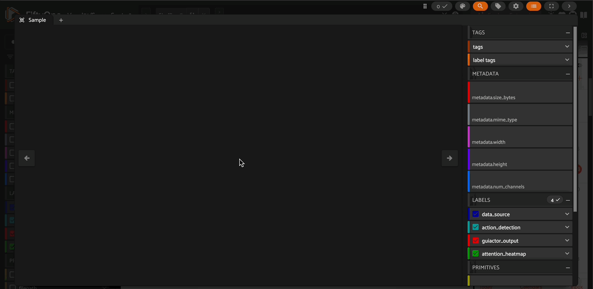

# GUI-Actor FiftyOne Integration

A FiftyOne integration for Microsoft's GUI-Actor vision-language models, enabling GUI automation and visual interface analysis with rich attention visualization.



## Overview

GUI-Actor is a multimodal foundation model designed for GUI automation tasks. This integration brings GUI-Actor's capabilities to FiftyOne, allowing you to:

- **Predict interaction points** on GUI screenshots with confidence scores
- **Visualize attention maps** showing where the model focuses
- **Analyze GUI understanding** across datasets of interface screenshots
- **Evaluate model performance** on GUI automation tasks

## Features

- **Keypoint Detection**: Identifies optimal interaction points for GUI automation
- **Attention Heatmaps**: Automatically stores attention maps on samples for visualization
- **Multiple Model Sizes**: Support for both 3B and 7B parameter variants
- **Flexible Prompting**: Use custom prompts or dataset instruction fields
- **Seamless Integration**: Works with FiftyOne's dataset management and visualization

## Installation

```bash
# Install FiftyOne
pip install fiftyone

```

## Quick Start

```python
import fiftyone as fo
import fiftyone.zoo as foz
from fiftyone.utils.huggingface import load_from_hub

# Load a GUI dataset
dataset = load_from_hub("Voxel51/ScreenSpot-v2", shuffle=True)

# Register the model source
foz.register_zoo_model_source("https://github.com/harpreetsahota204/gui_actor")

# Load the GUI-Actor model
model = foz.load_zoo_model("microsoft/GUI-Actor-7B-Qwen2.5-VL")

# Apply model to dataset
# Keypoints are stored in "guiactor_output"
# Attention heatmaps are automatically stored in "gui_actor_heatmap"
dataset.apply_model(
    model, 
    prompt_field="instruction",  # Use dataset's instruction field
    label_field="guiactor_output"
)

# Visualize results
session = fo.launch_app(dataset)
```

## Model Variants

| Model | Parameters | Description |
|-------|------------|-------------|
| `microsoft/GUI-Actor-3B-Qwen2.5-VL` | 3B | Lightweight version for faster inference |
| `microsoft/GUI-Actor-7B-Qwen2.5-VL` | 7B | Full-size model with best performance |

## Output Format

The model stores two fields on each sample:

- **Keypoints** (`label_field`): Interaction points with confidence scores
- **Attention Heatmap** (`gui_actor_heatmap`): Attention map stored as `fo.Heatmap`

### Keypoint Structure
```python
fo.Keypoint(
    label="top_interaction_point",
    points=[[x, y]],  # Normalized coordinates [0,1]
    confidence=[confidence_score],  # Model confidence
    reasoning="the model's output text"  # Custom attribute
)
```

### Attention Heatmap
- Stored automatically as `gui_actor_heatmap` field on each sample
- Contains normalized attention scores in `[0, 1]` range
- Stored at native model resolution (FiftyOne handles resizing for visualization)
- Visualize in the FiftyOne App as a heatmap overlay

## Advanced Usage

### Custom Prompts
```python
# Use a custom prompt instead of dataset field
model = foz.load_zoo_model("microsoft/GUI-Actor-7B-Qwen2.5-VL")
model.prompt = "Click the login button"

# Apply to dataset
predictions = dataset.apply_model(model, label_field="custom_predictions")
```

## Integration Details

### Model Architecture
- Based on Qwen2.5-VL with pointer generation capabilities
- Uses attention-based grounding for spatial understanding
- Supports multiple candidate region detection
- Implements specialized pointer tokens for coordinate generation

## License

This integration is licensed under the Apache 2.0 License. The GUI-Actor models are licensed under the MIT License.

# Citation

```bibtex
@article{wu2025gui,
  title={GUI-Actor: Coordinate-Free Visual Grounding for GUI Agents},
  author={Wu, Qianhui and Cheng, Kanzhi and Yang, Rui and Zhang, Chaoyun and Yang, Jianwei and Jiang, Huiqiang and Mu, Jian and Peng, Baolin and Qiao, Bo and Tan, Reuben and others},
  journal={arXiv preprint arXiv:2506.03143},
  year={2025}
}
```